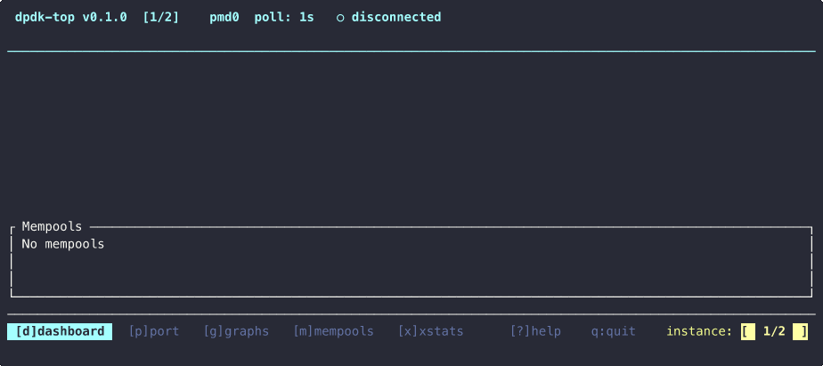

# dpdk-top

Real-time terminal monitoring for [DPDK](https://www.dpdk.org/) applications.

Connects to any running DPDK process via the telemetry Unix socket and displays live port stats, throughput rates, per-queue distribution, mempool utilization, and historical charts — without modifying the monitored application or linking against DPDK.

Works with **testpmd**, **l3fwd**, and any custom DPDK application that has telemetry enabled (default since DPDK 19.11).



## Install

**Pre-built binary (Linux / macOS):**
```bash
curl -sSL https://raw.githubusercontent.com/njenia/dpdk-top/main/install.sh | bash
```
Downloads a static binary from [GitHub Releases](https://github.com/njenia/dpdk-top/releases) — no dependencies, no Rust toolchain needed.

**With cargo:**
```bash
cargo install dpdk-top
```

**From source:**
```bash
git clone https://github.com/njenia/dpdk-top.git
cd dpdk-top
cargo build --release
sudo cp target/release/dpdk-top /usr/local/bin/
```

## Quick start

```bash
# Auto-detect DPDK socket and launch TUI
sudo dpdk-top

# Point to a specific socket
dpdk-top -s /var/run/dpdk/rte/dpdk_telemetry.v2

# One-shot JSON output (for scripting)
dpdk-top --once

# Stream JSON every 500ms
dpdk-top --json -i 0.5
```

## TUI views

| Key | View | Description |
|-----|------|-------------|
| `d` | Dashboard | Overview of all ports and mempools |
| `p` | Port detail | Counters, rates, and per-queue distribution for selected port |
| `g` | Graphs | Rolling sparkline charts for pps, throughput, errors |
| `m` | Mempools | Detailed mempool utilization with color-coded bars |
| `x` | Xstats | Full extended statistics table |
| `?` | Help | All keybindings |

**Navigation:**
- `↑`/`↓` or `j`/`k` — select port
- `Tab` / `Shift-Tab` — cycle views forward / backward
- `[` / `]` or `1`–`9` — switch DPDK instance (when multiple are discovered)
- `q` or `Esc` — quit

## Multi-instance support

When multiple DPDK processes are running (e.g. separate `testpmd` instances with different `--file-prefix`), dpdk-top auto-discovers all telemetry sockets and lets you switch between them:

```
Found 3 DPDK processes:
  [1] /var/run/dpdk/pmd0/dpdk_telemetry.v2
  [2] /var/run/dpdk/pmd1/dpdk_telemetry.v2
  [3] /var/run/dpdk/pmd2/dpdk_telemetry.v2
```

Press `1`, `2`, `3` or `[` / `]` to switch between instances in the TUI.

## CLI options

| Option | Description |
|--------|-------------|
| `-s, --socket <PATH>` | Telemetry socket path (default: auto-detect) |
| `-i, --interval <SECS>` | Poll interval in seconds (default: 1.0) |
| `--port <ID>` | Start with this port selected |
| `--once` | Print one snapshot with rates and exit |
| `--json` | Stream JSON to stdout |
| `--smooth <ALPHA>` | EMA smoothing 0.0–1.0 (default: 0.8) |
| `--no-color` | Disable colors |
| `-a, --alert <RULE>` | Alert rule, e.g. `rx_missed_errors>0` |

## How it works

dpdk-top communicates with the [DPDK telemetry](https://doc.dpdk.org/guides/howto/telemetry.html) Unix socket (`/var/run/dpdk/<prefix>/dpdk_telemetry.v2`). This socket is exposed by any DPDK application that calls `rte_eal_init()` with telemetry enabled (the default).

It queries these endpoints:

| Endpoint | Data |
|----------|------|
| `/ethdev/list` | Port IDs |
| `/ethdev/info,<id>` | Port configuration (driver, MAC, queues) |
| `/ethdev/stats,<id>` | Packet/byte counters |
| `/ethdev/xstats,<id>` | Extended per-queue stats |
| `/mempool/list` | Mempool names |
| `/mempool/info,<name>` | Mempool size and utilization |

Rates are computed as deltas between polls with configurable EMA smoothing.

## Requirements

- A running DPDK application with telemetry enabled
- Access to the telemetry socket (may require `sudo` if the DPDK app runs as root)
- Linux (primary) or macOS (for development; socket connection uses fallback mode)

## License

Apache-2.0 OR MIT
